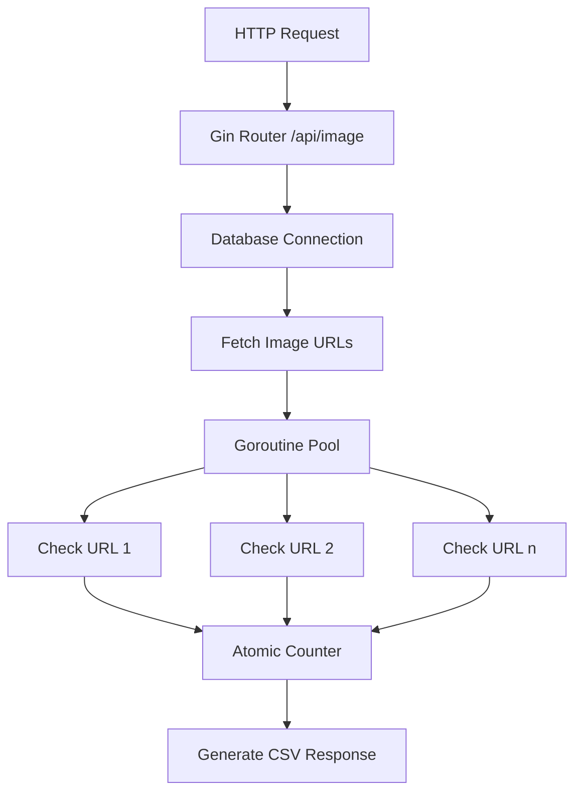

# image-identify



## Technical Design

Components:
Gin HTTP Server
MySQL Database
Worker Pool for URL checking
Atomic Counter for statistics
CSV Response Generator

### Required Packages

> go get -u github.com/gin-gonic/gin
> go get -u gorm.io/gorm
> go get -u gorm.io/driver/mysql
> go get -u github.com/joho/godotenv

### Project Structure

```main
├── main.go
├── .env
├── config/
│   └── database.go
├── models/
│   └── website.go
├── handlers/
│   └── image_handler.go
├── services/
│   └── url_checker.go
└── utils/
    └── csv_generator.go
```

### Environments

```env
DB_HOST=localhost
DB_USER=root
DB_PASSWORD=your_password
DB_NAME=image_checker
DB_PORT=3306
SERVER_PORT=8080
WORKER_POOL_SIZE=10
```
