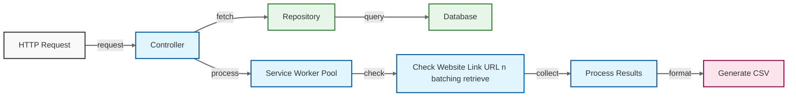

# Website URL Checker



## Project Structure

```main
├── main.go                 # Application entry point
├── .env                    # Environment variables
├── config/
│   └── database.go         # Database configuration
├── controllers/
│   └── website_controller.go # Business logic handler
├── repositories/
│   └── hotel_repository.go  # Database operations
├── models/
│   └── hotel.go            # Hotel model
├── services/
│   └── url_checker.go      # URL checking service
└── utils/
    └── csv_generator.go    # CSV generation utility

```

## Architecture

- **Controllers**: Handle HTTP requests and orchestrate business logic
- **Repositories**: Manage database operations and data access
- **Services**: Contain core business logic and processing
- **Models**: Define data structures and database schemas
- **Utils**: Provide helper functions and utilities
- **Config**: Handle application configuration

## Required Packages

```bash
go get -u github.com/gin-gonic/gin
go get -u gorm.io/gorm
go get -u gorm.io/driver/mysql
go get -u github.com/joho/godotenv
go get -u github.com/sirupsen/logrus
```

## Environment Variables

```env
DB_HOST=localhost
DB_USER=root
DB_PASSWORD=your_password
DB_NAME=your_database
DB_PORT=3306
SERVER_PORT=8080
WORKER_POOL_SIZE=10
```

## Running the Application

```bash
# Normal run
make run

# Development mode with hot reload
make dev

# Build binary
make build

# Clean build artifacts
make clean
```

## API Endpoints

### Check Websites

```bash
GET /api/link-checker
```

Response: CSV file with columns:

- Hotel ID
- Hotel Name
- Website URL
- Status (Color coded: Green for Success, Red for Failed)

## CSV Output Format

The CSV includes:

- Color-coded status:
  - Success: Green (#008000)
  - Failed: Red (#FF0000)
- Summary section with:
  - Total Hotels
  - Empty Website Links count
  - Check Date and Time

## Testing

```bash
# Using curl
curl -H "Accept: text/csv" http://localhost:9000/api/link-checker --output results.csv

# Using Postman
GET http://localhost:9000/api/link-checker
# Will automatically download CSV file
```

## Contributing

1. Fork the repository
2. Create your feature branch (`git checkout -b feature/amazing-feature`)
3. Commit your changes (`git commit -m 'Add some amazing feature'`)
4. Push to the branch (`git push origin feature/amazing-feature`)
5. Open a Pull Request

## License

This project is licensed under the MIT License - see the LICENSE file for details
